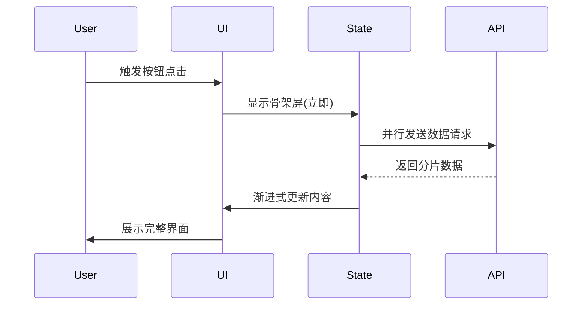

# 架构设计方案
## 任务
优化首页按钮响应速度，增加加载骨架屏
## 架构师
Claude Code (DeepSeek V3)
---
```markdown
# 首页按钮响应速度优化及骨架屏方案

## 1. 架构概览
```
┌─────────────────────────────────────────────────┐
│                    Client                       │
│  ┌─────────────┐  ┌─────────────┐  ┌─────────┐ │
│  │ Button      │  │ Skeleton    │  │ API     │ │
│  │ Optimization│  │ Screen      │  │ Proxy   │ │
│  └──────┬──────┘  └──────┬──────┘  └────┬────┘ │
│         │                │              │      │
├─────────┼────────────────┼──────────────┼──────┤
│         │                │              │      │
│  ┌──────▼──────┐  ┌──────▼──────┐ ┌─────▼────┐ │
│  │ State       │  │ UI          │ │ Network  │ │
│  │ Management  │  │ Components  │ │ Optimize │ │
│  └─────────────┘  └─────────────┘ └─────────┘ │
└─────────────────────────────────────────────────┘
```

## 2. 模块划分

### 2.1 前端模块
- **按钮优化模块**
  - 预加载关键资源
  - 交互反馈优化
  - 防抖/节流控制
- **骨架屏模块**
  - 占位组件设计
  - 加载状态管理
  - 过渡动画控制
- **API代理层**
  - 请求缓存
  - 数据预取
  - 错误降级

### 2.2 后端支持
- CDN静态资源优化
- 接口响应缓存
- 数据分片返回

## 3. 数据流


## 4. 关键决策

### 4.1 性能优化
- 采用Web Workers处理复杂计算
- 实现Intersection Observer进行懒加载
- 使用CSS will-change属性优化动画

### 4.2 骨架屏实现
- 选择组件级骨架屏而非全局
- 采用SVG-based占位方案
- 实现与真实DOM结构匹配的占位

### 4.3 监控体系
- 添加RUM(Real User Monitoring)
- 关键按钮埋点(click-to-render时间)
- 骨架屏显示时长统计

## 5. 风险点及应对

| 风险点                      | 缓解方案                                                                 |
|----------------------------|--------------------------------------------------------------------------|
| 骨架屏闪烁问题              | 实现双重缓冲机制，确保数据完全准备好再替换                               |
| 预加载资源过多              | 建立资源优先级体系，核心资源优先加载                                     |
| 接口响应变慢导致体验降级    | 设置超时阈值(如500ms)，超时后直接显示骨架屏                              |
| 低端设备性能问题            | 添加设备能力检测，动态降级方案                                           |
| 骨架屏与真实内容布局偏移    | 使用CSS aspect-ratio保持占位比例，实施CLS优化                            |
```

注：实际实施时需要：
1. 对现有项目进行性能基准测试
2. 在`D:/AI-Workshop/content-engine`中确认具体技术栈
3. 建立AB测试验证优化效果